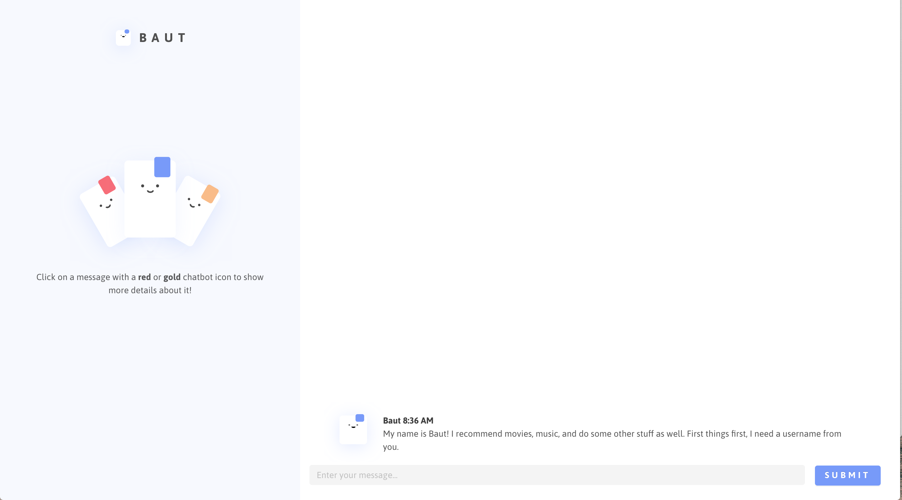
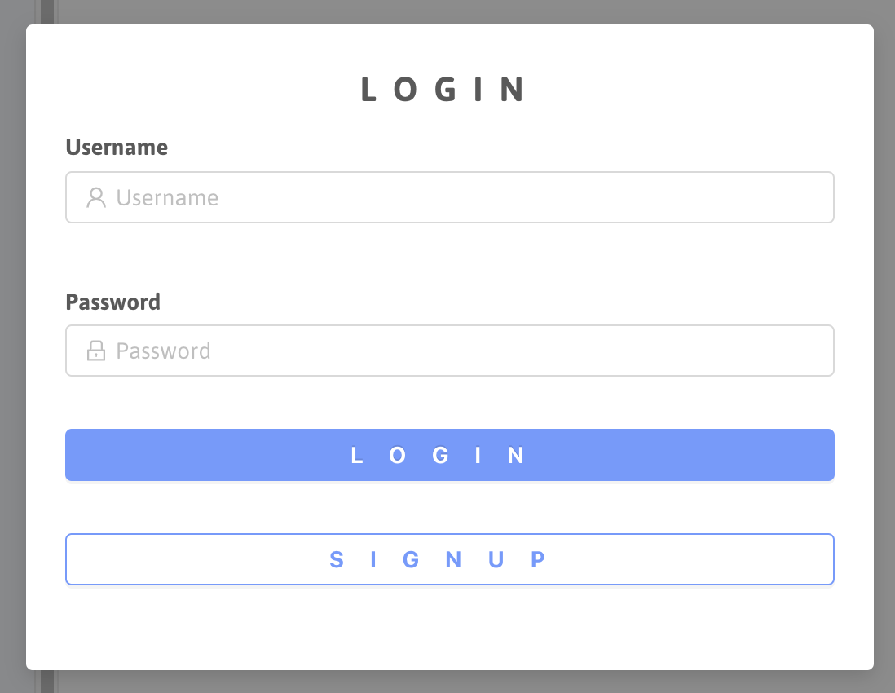
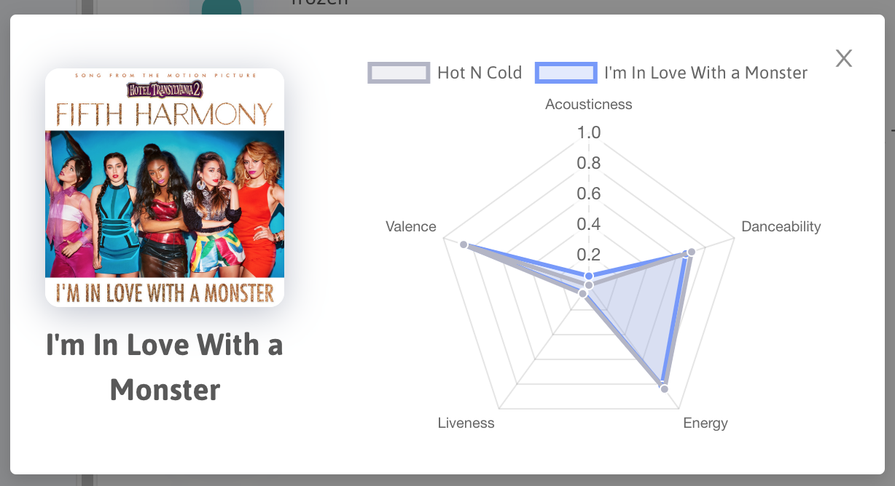
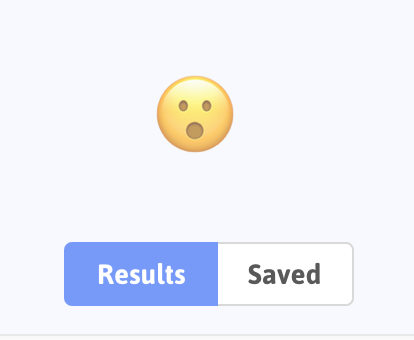

# Baut
Baut is a chatbot that helps recommend you songs and movies based on your relative feelings and personal lifestyle.

<p align="center">
  
</p>

## Frontend
The frontend is written in React, and is split up into several components. The main components that make up the user interface are `Panel`, `MessageForm`, and `MessageList`.

The `Panel` component is used to render any additional information that the chatbot will return back. For instance, when the chatbot returns movie or song recommendations (when the user clicks on the appropriate message), the `Panel` will display more information for the user, such as the movie poster, director, actors etc.

The `MessageForm` component simply takes in the user's input and sends it to the backend. The component also helps construct a `message` with the text.

The `MessageList` component holds all the `message` objects in an Array. It also chooses which type of message to render to the user, such as a normal chatbot message, movie chatbot message, music chatbot message, and user message. Clicking on either a movie or music chatbot message will make the `Panel` component render additional information pertaining to the clicked message, as mentioned before.

<p align="center">
  
</p>

 In order to start the frontend, simply navigate to the `frontend` directory and execute the following.

```
npm install
```

Once the node packages have finished installing, you may now run the app by doing
```
npm start
```

The React app will compile and a browser should automatically open to `localhost:3000`, where you can proceed with the chatbot interface.

### Note
The backend url is stored in a variable called `const BASE_URL` located in `frontend/src/constants.js`. When running the backend locally, just replace the value of the variable with the `localhost` url.

## Backend
The backend is written in Flask, a Python microframework that makes creating endpoints quick and easy. Within this Flask app we have an endpoint call `api/chatbot`. This endpoint handles all of the dialog flow from the user to the bot. 

To run the chatbot, run `pip install -r requirements.txt` and then run `python3 chatbot.py`. The first it runs, it will take some time as the script will downlod the `dataset_cache_OpenAIGPTTokenizer` file. 

## Recommendation Endpoint
The recommendation endpoint is also Flask-based. It uses the [MovieLens](https://grouplens.org/datasets/movielens/), specifically, the `ml-latest` version. A README describing what the dataset contains can be found [here](http://files.grouplens.org/datasets/movielens/ml-latest-README.html). The dataset provides anonymized user ratings of movies.

We used the dataset to perform collaborative filtering on the inputs. We initially chose to use a stream factorization machine provided by the [FluRS](https://github.com/takuti/flurs) library, but we found that it was unable to accurately recommend movies. Because of this, we switched to the [LightFM](https://github.com/lyst/lightfm) library. We chose to structure the problem as an implicit feedback problem, rather than as an explicit one. This means that we considered only positive recommendations and treated each rating as a binary value. We read that this is better for the top-K recommendation problem.

However, we still encountered difficulty with accurately recommending movies due to the heavy imbalance in the dataset. We found that the algorithm tends to recommend older movies with high confidence, even without any ratings that support that choice. However, we were able to mitigate this issue by calculating the recommendation for users without any ratings and using that to offset the results for users with ratings.

## New Features
### Frontend
Baut will have a prompt asking the user to login or sign in upon navigating to the website.
<p align="center">
  
</p>

Baut lets you save (and delete) all of your recommended songs and movies. To save a movie or song, just click on the star button under each recommendation, and to view what you've saved so far, just navigate to the `Saved` panel.
<p align="center">
  
</p>

Feeling cluttered? We've moved (most of) the details from the recommended songs and movies to a different component. For a both the songs and the movies, just click on their titles to see more!
<p align="center">
  
</p>

Notice the webcam prompt and emoji(s)? Baut can analyze your face to extract the different emotions as you react to the different movies. As you browse through the different movie recommendations, Baut will take into account how you react to each movie and tune your recommendations accordingly. 
Using the Face API, we used the Tiny Face Detector, which returns the detected faces with the highest scores. From there we used the Face Recognition Model, making it both lightweight and reasonably accurate. The Tiny Face Detector is a lot smaller in size compared to the SSD Mobilenet,and is faster in terms of detection speed.

<p align="center">
  
</p>

### Backend
The old version of this bot used the chatterbot library to respond to any conversational flow. For this iteration however, the bot uses the Open AI GPT pretrained model in order to handle the conversational aspect of the bot. The bot has already been pretrained using a large scale language model. We chose to use a pretrained model because it would have taken more time and compuiting power than we had at our disposal to train our own model. The download of the cache file itself takes around fifteen minutes on first start up of the app. 

The code for the pretrained model we used can be found [here](https://github.com/huggingface/transfer-learning-conv-ai)

### Music Recommendations
Previously, Baut recommended the user different songs depending on his/her lifestyle. This time, we're using Spotify (via SpotiPy) to calculate and fetch similar songs. When the user types in a song name, Baut looks at songs of the similar artists of the entered song. Then, using K-Nearest Neighbors (K-NN) against the song's features, it returns a list of the songs similar to what the user entered! Since K-NN is deterministic, the user will see the same songs recommendations depending on the inputted song.
